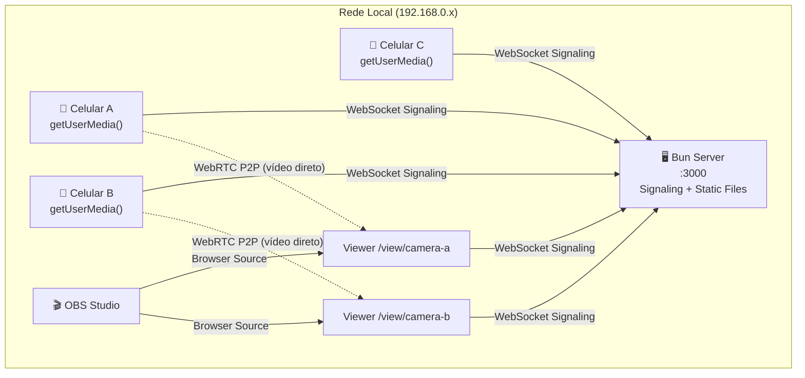

# Haziel — Streaming de câmeras via WebRTC para OBS

> **חזיאל** — *"A quem Deus vê"* · *"Visão de Deus"*

Projeto para capturar câmeras de dispositivos na rede local e disponibilizá-las como fontes para o OBS Studio via Browser Source.

---

## Arquitetura Geral



### Fluxo WebRTC Detalhado

```
Sender (Celular)               Signaling Server (Bun)            Viewer (OBS Browser Source)
     |                                  |                                  |
     |-- WS: register(name, pin) ------>|                                  |
     |<-- WS: registered ---------------|                                  |
     |                                  |                                  |
     |                                  |<------ WS: view(name, pin) ------|
     |<-- WS: viewer-joined ------------|                                  |
     |                                  |                                  |
     |-- createOffer() + getUserMedia() |                                  |
     |-- WS: offer ------------------->.|.---------- WS: offer ---------->|
     |                                  |                                  |
     |                                  |<--------- WS: answer -----------|
     |<-- WS: answer ------------------|                                  |
     |                                  |                                  |
     |-- WS: ice-candidate ----------->.|.---- WS: ice-candidate ------->|
     |<-- WS: ice-candidate -----------.|.<--- WS: ice-candidate --------|
     |                                  |                                  |
     |=============== P2P Video Stream (direto, sem servidor) =============|
```

### Pontos-chave da arquitetura:
- **O vídeo NÃO passa pelo servidor** — é P2P direto entre sender e viewer
- **O servidor só faz sinalização** — troca de SDP offers/answers e ICE candidates via WebSocket
- **Cada viewer cria uma PeerConnection separada** com o sender
- **Máximo 10 dispositivos**, cada um podendo ter múltiplos viewers (OBS sources)

---

## Stack Tecnológica

| Camada | Tecnologia | Justificativa |
|--------|-----------|---------------|
| Runtime | **Bun** | WebSocket nativo, HTTP server built-in, rápido |
| Frontend | **React 19 + Vite** | Leve, HMR rápido, sem SSR desnecessário |
| UI | **shadcn/ui + Tailwind CSS v4** | Componentes bonitos, customizáveis |
| Streaming | **WebRTC** | Baixa latência, alta qualidade, P2P |
| Signaling | **Bun WebSocket** | Nativo, zero deps extras |
| Persistência | **IndexedDB (Dexie.js)** | Client-side, sessão do PIN, preferências |
| OBS | **Browser Source** | Sem plugin necessário, URL direto |

---

## Estrutura do Projeto

```
haziel/
├── server/
│   ├── index.ts              # Entry point Bun server
│   ├── signaling.ts          # WebSocket signaling handlers
│   ├── device-registry.ts    # Registro in-memory de dispositivos
│   └── auth.ts               # Validação do PIN
├── src/
│   ├── main.tsx              # React entry
│   ├── App.tsx               # Router principal
│   ├── pages/
│   │   ├── AuthPage.tsx      # Tela de PIN (4 dígitos)
│   │   ├── ConnectPage.tsx   # Sender: abrir câmera, escolher nome
│   │   └── ViewerPage.tsx    # Viewer: exibir stream (para OBS)
│   ├── components/
│   │   ├── ui/               # shadcn components
│   │   ├── PinInput.tsx      # Input de 4 dígitos
│   │   ├── CameraPreview.tsx # Preview da câmera local
│   │   ├── DeviceStatus.tsx  # Badge online/offline
│   │   └── VideoPlayer.tsx   # Player de vídeo remoto
│   ├── hooks/
│   │   ├── useWebSocket.ts   # Conexão WebSocket com reconexão
│   │   ├── useWebRTC.ts      # Gerenciamento WebRTC (sender/viewer)
│   │   ├── useCamera.ts      # getUserMedia + seleção de câmera
│   │   └── useAuth.ts        # PIN auth + sessão
│   ├── lib/
│   │   ├── signaling.ts      # Protocolo de mensagens WS
│   │   ├── db.ts             # IndexedDB via Dexie.js
│   │   └── constants.ts      # Config compartilhada
│   └── styles/
│       └── index.css         # Tailwind + custom styles
├── public/
│   └── favicon.svg
├── docs/
│   ├── implementation_plan.md
│   └── CHANGELOG.md
├── index.html
├── vite.config.ts
├── tsconfig.json
├── tsconfig.node.json
├── package.json
├── README.md
└── .env                      # CAM_PIN=1234, PORT=3000
```

---

## Detalhamento dos Componentes

### Componente 1: Setup do Projeto

#### `package.json`
- Dependências: `react`, `react-dom`, `react-router-dom`, `dexie`
- DevDependencies: `vite`, `@vitejs/plugin-react`, `typescript`, `tailwindcss`, `@tailwindcss/vite`
- Scripts: `dev` (frontend), `server` (bun server), `dev:all` (ambos paralelos), `build`, `start` (production)

#### `vite.config.ts`
- Plugin React + Tailwind
- Alias `@/` para `./src`
- Proxy do WebSocket para o Bun server em dev (`/ws` → `ws://localhost:3001`)
- Configurar `server.host: true` para aceitar conexões da rede local

#### `.env`
```
CAM_PIN=1234
PORT=3000
```

---

### Componente 2: Servidor Bun (Signaling)

#### `server/index.ts`
- `Bun.serve()` na porta configurada
- Em produção: serve arquivos estáticos do `dist/`
- WebSocket upgrade em `/ws`
- Bind em `0.0.0.0` para aceitar conexões da rede

#### `server/signaling.ts`
- Protocolo de mensagens:
  - `register` — sender registra dispositivo (nome + PIN)
  - `view` — viewer solicita stream de um dispositivo
  - `offer/answer/ice-candidate` — relay de sinalização WebRTC
  - `heartbeat` — keep-alive
  - `disconnect` — desconexão limpa
- Validação de nomes únicos
- Broadcast de eventos (device-online, device-offline)

#### `server/device-registry.ts`
- `Map<string, DeviceInfo>` — registro in-memory
- `DeviceInfo`: nome, WebSocket ref, status, timestamp
- Métodos: `register()`, `unregister()`, `getDevice()`, `listDevices()`, `isNameTaken()`

#### `server/auth.ts`
- Validação do PIN contra `process.env.CAM_PIN`
- Gera token simples (UUID) após auth válida
- Valida token em mensagens subsequentes

---

### Componente 3: Frontend — Páginas

#### `src/pages/AuthPage.tsx`
- Input de 4 dígitos com visual shadcn (InputOTP)
- Valida PIN via WebSocket
- Salva token de sessão no IndexedDB
- Redireciona para `/connect` ou `/view/:name` conforme query param
- Design: dark theme, logo, animação de entrada

#### `src/pages/ConnectPage.tsx`
- Campo para definir nome do dispositivo (com validação unique em tempo real)
- Seletor de câmera (dropdown das câmeras disponíveis via `enumerateDevices`)
- Seletor de qualidade (resolução): 4K, 1080p, 720p, auto
- Preview da câmera local
- Botão "Iniciar Streaming"
- Status: conectando, ao vivo, desconectado
- Mostra a URL para copiar e usar no OBS: `http://{IP}:{PORT}/view/{nome}`

#### `src/pages/ViewerPage.tsx`
- Rota: `/view/:deviceName`
- Suporta query param `?pin=XXXX` para autenticação automática (OBS Browser Source)
- Modo OBS: se `?obs=true`, mostra APENAS o vídeo (sem UI, sem padding, fullscreen)
- Modo normal: mostra vídeo com informações do dispositivo
- Estados visuais:
  - **Conectando:** spinner + "Conectando a {nome}..."
  - **Ao vivo:** vídeo fullscreen
  - **Offline:** ícone + "Dispositivo desconectado" + tentativa de reconexão
  - **Timeout (3min):** "Dispositivo desconectado permanentemente"
- Reconexão automática com backoff exponencial (max 3 minutos)

---

### Componente 4: Hooks Core

#### `src/hooks/useWebSocket.ts`
- Conexão WebSocket com reconexão automática
- Exponential backoff
- Heartbeat a cada 30s
- Tipagem forte das mensagens
- Callback handlers para cada tipo de mensagem

#### `src/hooks/useWebRTC.ts`
- **Modo Sender:**
  - Cria `RTCPeerConnection`
  - Adiciona tracks de vídeo do `getUserMedia`
  - Gera offer, processa answer
  - Gerencia ICE candidates
  - Suporta múltiplos viewers (uma PeerConnection por viewer)
- **Modo Viewer:**
  - Cria `RTCPeerConnection`
  - Processa offer, gera answer
  - Coleta ICE candidates
  - Retorna `MediaStream` remoto
  - Reconexão automática com timeout de 3 minutos

#### `src/hooks/useCamera.ts`
- `navigator.mediaDevices.getUserMedia()` com constraints de alta qualidade
- `enumerateDevices()` para listar câmeras
- Presets de qualidade: `{ 4k, 1080p, 720p, auto }`
- Troca de câmera em tempo real

#### `src/hooks/useAuth.ts`
- Envia PIN via WebSocket, recebe token
- Salva/recupera sessão do IndexedDB
- Verifica sessão válida no mount

---

### Componente 5: Persistência (IndexedDB)

#### `src/lib/db.ts`
- Dexie.js para IndexedDB
- Tabelas:
  - `session`: token de autenticação, timestamp
  - `preferences`: último nome usado, câmera preferida, qualidade
- Auto-limpeza de sessões expiradas

---

### Componente 6: Componentes UI (shadcn)

#### shadcn components necessários:
- `button`, `input`, `card`, `badge`, `select`, `toast`, `input-otp`, `separator`, `skeleton`

#### Componentes customizados:
- `PinInput.tsx` — wrapper do InputOTP shadcn para 4 dígitos
- `CameraPreview.tsx` — video element com overlay de status
- `DeviceStatus.tsx` — badge animada (online/offline/reconectando)
- `VideoPlayer.tsx` — player adaptativo (fullscreen para OBS, com controls para normal)

---

## Integração com OBS

### Como adicionar no OBS:
1. **Sources → Browser Source**
2. **URL:** `http://{IP_LOCAL}:3000/view/{nome-do-dispositivo}?pin=1234&obs=true`
3. **Resolução:** Configurar para a resolução desejada (1920x1080, etc.)
4. **FPS:** 30 ou 60

### Parâmetros da URL do Viewer:
| Param | Descrição | Exemplo |
|-------|-----------|---------|
| `pin` | PIN de autenticação (evita tela de login) | `?pin=1234` |
| `obs` | Modo OBS: remove toda UI, vídeo fullscreen | `&obs=true` |

### Comportamento no OBS:
- Quando o dispositivo está online → vídeo renderizado direto
- Quando offline → tela preta com texto "OFFLINE" (discreto)
- Reconexão automática → sem intervenção manual

---

## Verification Plan

### Testes Manuais (v1)
1. **Servidor:**
   - Iniciar com `bun run server` → acessível em `http://0.0.0.0:3000`
   - Acessar de outro dispositivo na rede via IP local
2. **Auth:**
   - PIN correto → acesso permitido
   - PIN errado → acesso negado com feedback visual
3. **Camera Sender:**
   - Abrir no celular → selecionar câmera → iniciar streaming
   - Nome duplicado → mensagem de erro
4. **Viewer/OBS:**
   - Abrir URL do viewer → vídeo aparece
   - Adicionar como Browser Source no OBS → vídeo renderiza
   - Desconectar dispositivo → tela "offline" → reconectar → stream volta
   - Aguardar 3 min → "dispositivo desconectado permanentemente"
5. **Multi-dispositivo:**
   - 3+ dispositivos streaming simultaneamente
   - Cada viewer mostra o dispositivo correto

### Verificação Automatizada (futura)
- Testes unitários para hooks (`useWebRTC`, `useWebSocket`)
- Testes E2E com Playwright para fluxo de auth e conexão
